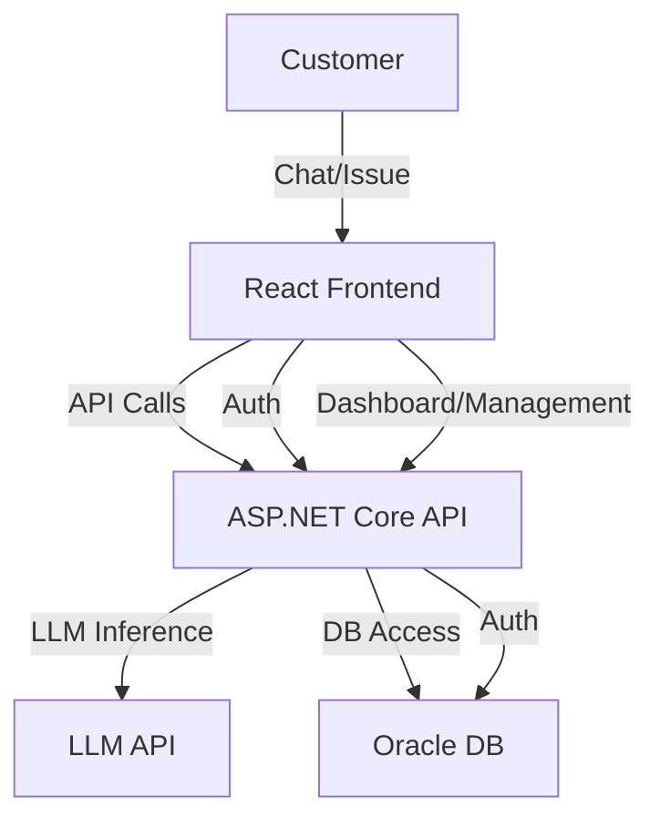

# Customer Support Ticket System

A full-stack, AI-powered customer support ticketing platform that leverages Large Language Models (LLMs) for automated issue categorization, empathetic response generation, and streamlined support workflows. The system features a robust ASP.NET Core backend and a modern React + TypeScript frontend.

---

## Table of Contents

- [Features](#features)
- [Architecture Overview](#architecture-overview)
- [Project Structure](#project-structure)
- [Frontend Details](#frontend-details)
- [Backend Details](#backend-details)
- [Database Schema & Migrations](#database-schema--migrations)
- [API Endpoints](#api-endpoints)
- [Getting Started](#getting-started)
- [Customization](#customization)
- [Technologies Used](#technologies-used)
- [License](#license)
- [Acknowledgments](#acknowledgments)

---

## Features

- **AI-Powered Chat**: Customers interact with an LLM assistant for instant, empathetic support.
- **Automatic Issue Categorization**: AI classifies issues (e.g., Payment, Delivery, Technical Support).
- **Ticket Tracking**: All issues are tracked in a database for follow-up and analytics.
- **Support Dashboard**: Visual dashboard for support staff to monitor, filter, and analyze customer problems.
- **User Management**: Admins can manage agents and users, assign roles, and control access.
- **Statistics & Analytics**: View problem category breakdowns, open/closed issue counts, and recent tickets.
- **Authentication**: Secure login for agents and admins, JWT-based.
- **Modern UI**: Responsive web interface built with React, TypeScript, and Tailwind CSS.

---

## Architecture Overview



---

## Project Structure

```
customer_support_ticket_system/
├── LLMInferenceService/    # ASP.NET Core backend (API, Razor Pages, EF Core)
│   ├── InferenceController.cs
│   ├── Program.cs
│   ├── Pages/              # Razor Pages (Dashboard, Index, Layout)
│   ├── Migrations/         # EF Core migrations
│   ├── appsettings.json
│   └── ...
└── frontend_v2/            # React + TypeScript frontend (Vite, Tailwind CSS)
    ├── src/
    │   ├── components/     # ChatInterface, TicketManagement, UserManagement, LoginForm
    │   ├── services/       # api.ts (API integration)
    │   ├── contexts/       # AuthContext (state management)
    │   ├── types/          # TypeScript interfaces for User, Ticket, etc.
    │   └── App.tsx, main.tsx
    └── ...
```

---

## Frontend Details

- **ChatInterface.tsx**: Customer-facing chat UI. Sends messages to the backend, displays categorized responses, and shows ticket tracking status.
- **TicketManagement.tsx**: Agent/admin dashboard for viewing, filtering, updating, and assigning tickets. Supports status changes and analytics.
- **UserManagement.tsx**: Admin interface for managing users, roles, and activation status.
- **LoginForm.tsx**: Secure login form with demo credentials and error handling.
- **AuthContext.tsx**: Provides authentication state and methods (login, logout) across the app.
- **api.ts**: Handles all API requests, JWT management, and error handling.
- **TypeScript Types**: Strongly typed models for User, Ticket, Message, API responses, etc.

### UI/UX

- Built with React, TypeScript, Tailwind CSS for a modern, responsive experience.
- Role-based access: Customers (chat), Agents (ticket management), Admins (user/ticket management).
- Real-time feedback, loading states, and error handling.

---

## Backend Details

- **ASP.NET Core 9**: RESTful API and Razor Pages for dashboard and chat.
- **InferenceController.cs**: Handles LLM inference, ticket creation, categorization, and statistics endpoints.
- **Entity Framework Core (Oracle)**: ORM for database access, migrations, and schema management.
- **Authentication**: JWT-based, with role-based authorization for endpoints.
- **Razor Pages**: For legacy or admin dashboard UI (optional if using React frontend).

---

## Database Schema & Migrations

- **Migrations**: Located in `LLMInferenceService/Migrations/`, including identity tables for users, tickets, and roles.
- **Entities**:
  - **User**: id, email, name, role (Admin/Agent/Customer), isActive, createdAt
  - **Ticket**: id, customerMessage, problemCategory, status, assignedTo, adminNotes, timestamps
  - **TicketStats**: category, total, open, inProgress, solved, closed

---

## API Endpoints

- `POST /api/inference` — Submit a customer message for LLM categorization and response.
- `GET /api/inference/problems/stats` — Retrieve statistics for problem categories.
- `GET /api/inference/problems/recent?limit=10` — Get recent customer problems.
- `POST /api/auth/login` — User login, returns JWT and user info.
- `POST /api/auth/register` — Register a new user (admin only).
- `GET /api/tickets` — List all tickets (admin/agent).
- `POST /api/tickets/assign` — Assign ticket to agent (admin).
- `PATCH /api/tickets/:id/status` — Update ticket status (agent/admin).
- `GET /api/users` — List users (admin).
- `PATCH /api/users/:id/status` — Activate/deactivate user (admin).

---

## Getting Started

### Prerequisites

- [.NET 9 SDK](https://dotnet.microsoft.com/download/dotnet/9.0)
- Oracle Database (local or remote)
- Node.js (for frontend)

### Backend Setup

1. **Configure Database**  
   Update the Oracle connection string in `LLMInferenceService/Program.cs`:
   ```csharp
   var connectionString = "Data Source=localhost:1521/FREE;User Id=YOUR_USER;Password=YOUR_PASSWORD;";
   ```

2. **Set LLM API Endpoint**  
   Update the LLM API URL in `LLMInferenceService/InferenceController.cs`.

3. **Apply Database Migrations**
   ```bash
   dotnet ef database update --project LLMInferenceService
   ```

4. **Run Backend**
   ```bash
   dotnet run --project LLMInferenceService
   ```
   The backend will be available at `https://localhost:7120` or as configured.

### Frontend Setup

1. **Install Dependencies**
   ```bash
   cd frontend_v2
   npm install
   ```

2. **Run Frontend**
   ```bash
   npm run dev
   ```
   The frontend will be available at `http://localhost:5173` (default Vite port).

---

## Customization

- **LLM Model**: Change the model or API endpoint in `InferenceController.cs`.
- **Categories**: Update or expand categories in the system prompt within `InferenceController.cs`.
- **UI**: Modify React components in `frontend_v2/src/components/` or Razor Pages in `LLMInferenceService/Pages/`.
- **Roles & Permissions**: Adjust user roles and access logic in backend and frontend types.

---

## Technologies Used

- **Backend**: ASP.NET Core 9, Entity Framework Core (Oracle), Razor Pages
- **Frontend**: React, TypeScript, Vite, Tailwind CSS
- **Authentication**: JWT, role-based access
- **AI**: Large Language Model API (configurable)
- **Other**: Bootstrap 5 (legacy UI), Lucide Icons

---

## License

This project is for educational and demonstration purposes.  
For production use, review and update security, error handling, and compliance as needed.

---

## Acknowledgments

- [Microsoft ASP.NET Core](https://docs.microsoft.com/aspnet/core/)
- [Oracle Entity Framework Core](https://docs.oracle.com/en/database/oracle/oracle-data-access-components/ef-core/)
- [React](https://react.dev/)
- [Tailwind CSS](https://tailwindcss.com/)
- [Bootstrap](https://getbootstrap.com/)

---

**Tip:**  
Add project badges, screenshots, or a demo GIF for even more professional appeal!
